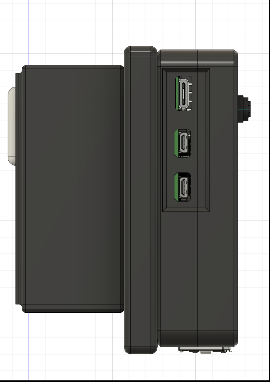
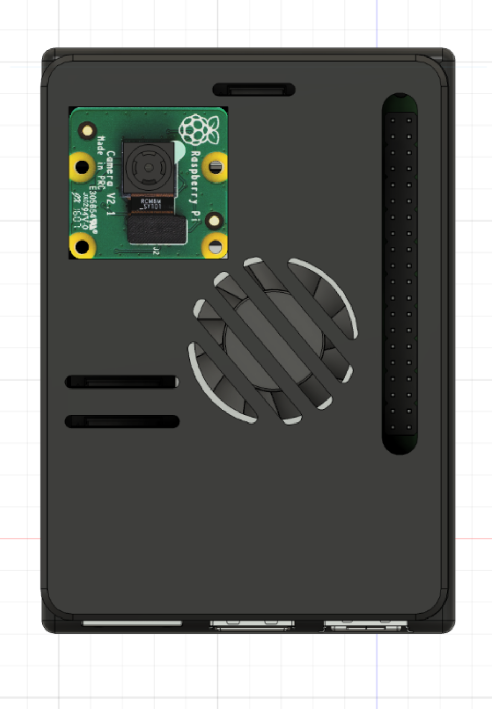
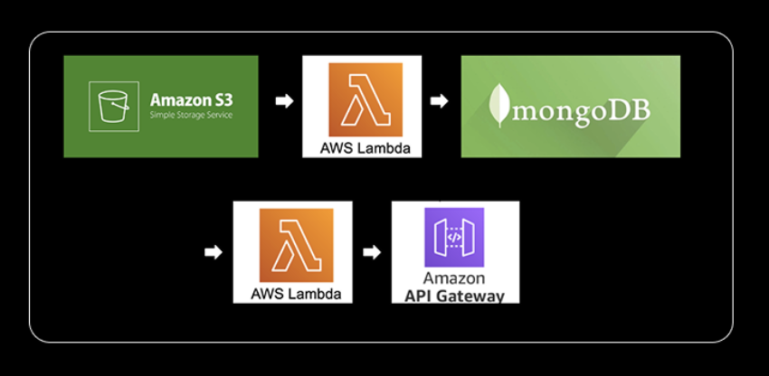
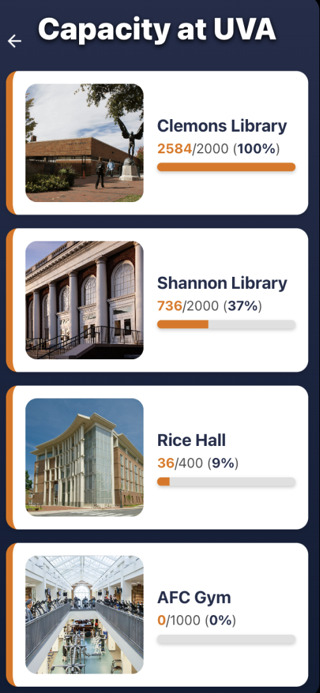
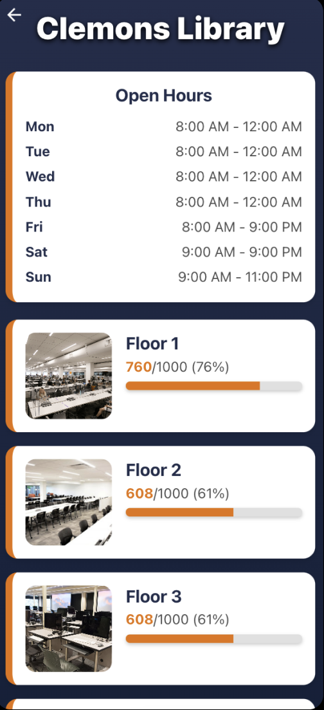

# UVA Building Capacity Tracker
ReactJS web/node.js backend repository: https://github.com/shivpatel0812/reactfrontend/tree/main

Expo React Native mobile repository: https://github.com/shivpatel0812/capacitymobilefrontend/tree/main

Capacity Prediction Algorithm: https://github.com/shivpatel0812/Capacityalgorithm/tree/main

## Project Overview

### Problem Statement:
UVA students currently lack real-time information on the capacity of popular locations on campus, including Clemons Library, Shannon Library, Mem Gym, and AFC Gym. This makes it challenging for students to effectively plan their schedules and access facilities without overcrowding. Our proposed solution is to develop a **computer vision-based camera system** integrated with a **web and mobile application**. This system will allow students to monitor the capacity of different UVA buildings in real time, helping them to manage their visits and schedules better.

The system will detect when a student enters or exits a building and then process this data on a local device (Raspberry Pi 5). The processed data will be sent to **AWS S3** for cloud processing, where it will be cleaned and analyzed before being displayed in a web and mobile application, providing real-time capacity statistics.

Our goal is to eventually expand the system to monitor the capacity of UVA buses, helping students manage their commutes efficiently.

---

## ent Design

### Hardware and Machine Learning Pipeline

#### Edge Device Components:
- **Raspberry Pi 5 + Camera**: Captures real-time video of people entering and exiting a building. The data is processed locally using the object detection model.
- **YOLOv8**: Used for object detection to count people entering and exiting the building.
- **Local Processing**: Video is broken into frames and analyzed using a YOLO-based model.
- **Motion Detection**: Only triggered when movement is detected to reduce the need for constant video processing.
- **WiFi Dongle**: Enables network communication to send the processed data from the Raspberry Pi to the cloud.
- **Power Source**: A USB-C power source to ensure continuous operation of the Raspberry Pi.

  
  
  
  

---

### Machine Learning Components:
- **YOLOv8**: Open-source object detection algorithm used for bounding box detection to count entries and exits (focusing on the movement of shoes).
- The results are processed locally and sent to the cloud using HTTP requests through a Node.JS API 

---

## Cloud Integration

### Data Transmission:
- Data (entry/exit counts and timestamp) is sent from the Raspberry Pi to the cloud using an HTTP request through a Node.JS API

### Backend and Cloud Infrastructure:
- **AWS S3 Storage**: The processed data is uploaded to a S3 bucket for further analysis and storage. Each entry is stored as a JSON object.
- **AWS Lambda Function**: Used to clean and update real-time data. These functions trigger automatically when new data is uploaded to AWS S3, allowing for real-time processing without the need for a constantly running server.
- **MongoDB**: Acts as the central database for storing processed data. MongoDB allows for efficient querying and scaling as the dataset grows.
- ****API Gateway + Lambda**: Lambhda constantly fetches updated data from Mongodb and APIgateway connects to frontend to send data

  

---

## Front-End Development

### Web and Mobile Application:
- **React**: The web application is being built using React, providing a simple and intuitive user interface to display building capacity data.
- **React Native / Expo**: The mobile app will be developed using React Native, allowing students to access real-time capacity information on their smartphones.

### Data Display:
- The front-end will display current capacity, historical trends, and predictions on crowding based on the processed data from AWS and MongoDB.

  
  

---

## Key System Components
- **Raspberry Pi 5**: Collects video data from attached cameras and performs initial object detection.
- **YOLOv8 Model**: Detects people entering and exiting the buildings.
- **AWS S3**: Stores processed data for further cloud-based processing.
- **AWS Lambdas**: Automatically cleans and processes data when it is uploaded to the cloud.
- **MongoDB**: Stores and manages the results for efficient access by the front-end applications.

---

## Potential Future Enhancements

### Integration with UVA Bus System:
- In the future, the same camera system can be installed on buses to track bus capacity. This data will help students determine bus availability and avoid crowded buses.

### Testing Locations:
- Initial testing will be performed in classrooms such as RICE Lecture Hall. After successful testing, we plan to implement the system in libraries like Clemons, Clarke, Shannon, and Alderman.
